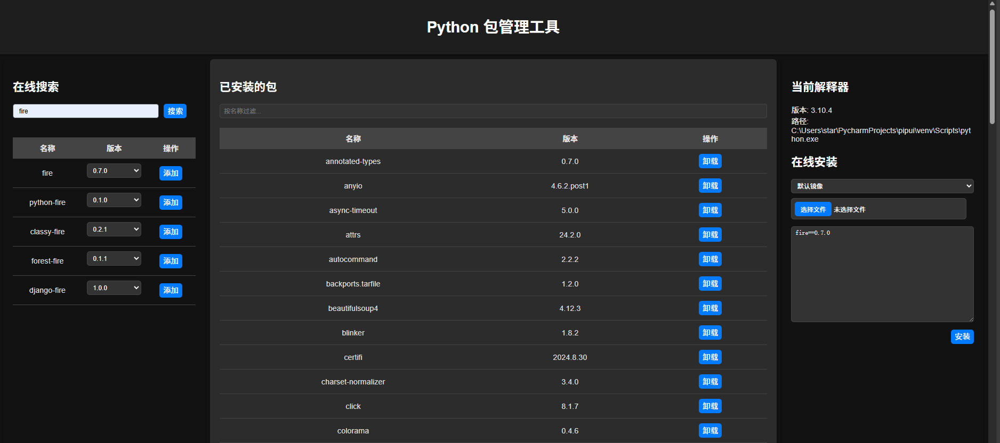

## Python 包管理工具
这是一个便捷的 Python 第三方库安装工具，旨在简化库的管理和安装过程。用户可以通过简单的图形界面搜索、浏览和安装所需的库，并支持多个常用的 pip 镜像源，以提高下载速度和稳定性。


### 软件环境要求

- **操作系统**：Windows, macOS, 或 Linux
- **Python 版本**：3.6 及以上
- **依赖库**：
  - Flask
  - pipui
  - 其他必要的 Python 库（可在 `requirements.txt` 文件中找到）

### 安装

1. **克隆项目**：
   ```bash
   git clone <项目仓库地址>
   cd <项目目录>
   ```

2. **创建虚拟环境（可选）**：
   ```bash
   python -m venv venv
   source venv/bin/activate  # Linux/macOS
   venv\Scripts\activate  # Windows
   ```

3. **安装依赖**：
   ```bash
   pip install -r requirements.txt
   ```

4. **启动应用**：
   ```bash
   python main.py
   ```
   默认情况下，应用将在 `http://0.0.0.0:6001` 上运行。

### 使用

- 打开浏览器，访问 `http://localhost:6001`。
- 在主界面中，你可以查看已安装的 Python 包、卸载包、搜索在线包并进行安装。

### 功能描述

1. **查看已安装的包**：
   - 应用启动后，自动加载并展示当前 Python 环境中已安装的所有包及其版本。

2. **过滤与排序**：
   - 提供过滤功能，用户可以通过输入包名快速找到特定的包。
   - 用户可以点击表头对包进行排序，方便管理。

3. **包卸载**：
   - 每个已安装的包旁边都有一个卸载按钮，用户可以直接卸载不需要的包。

4. **在线搜索**：
   - 用户可以输入包名进行在线搜索，支持从多个镜像源获取包信息。

5. **选择镜像源**：
   - 用户可以从下拉列表中选择不同的镜像源，以提高下载速度和稳定性。

6. **安装包**：
   - 在搜索结果中，用户可以选择指定版本的包进行安装，并能够根据选择的镜像源进行下载。

7. **解释器信息**：
   - 应用会显示当前 Python 解释器的信息，包括版本和路径，方便用户了解运行环境。


